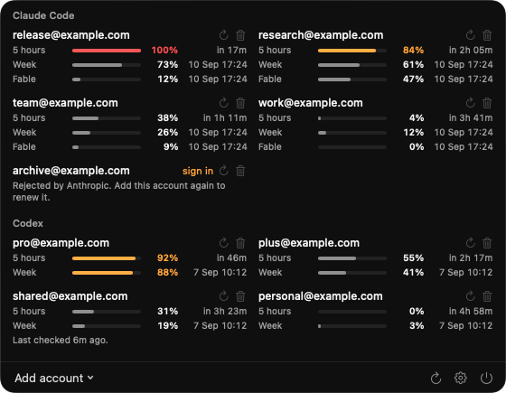

# Headroom AI

A macOS menu bar app that shows how much of your rate limit is left across many
Claude Code and Codex accounts at once: the five-hour window, the weekly one,
per-model limits, and when each resets.

It exists because both CLIs only ever show the account you happen to be logged
into. With a dozen subscriptions, finding a usable one means switching accounts
and checking, over and over.

## What it shows

Each account gets a cell with one line per limit window the provider reports.
Each line carries its label, how much is used, and when it comes back. Colour
appears only when something needs attention, amber past 80% and red at 100%, so
a quiet row is a healthy row.

The menu bar carries one indicator per provider. What the number means is yours
to choose in Settings:

| Setting | Answers |
| --- | --- |
| Best account | How full the emptiest account is, so where you would switch to |
| Busiest account | How full the fullest one is, so what is about to run out |
| Accounts with room | How many are still under 80% |

Whichever you pick, the icon fills the same way. Full means nothing left.

## Requirements

macOS 14 or later and a Swift 6 toolchain. No third-party dependencies.

## Build and run

    make app
    open ".build/Headroom AI.app"

    swift test

## Adding accounts

Click the menu bar icon, then **Add account**, and pick a provider. Your browser
opens; sign in there. There is nothing to type, because the account is
identified and labelled by the email address its provider reports.

Signing in here creates its own token pair. It does **not** touch the accounts
you are logged into in the `claude` or `codex` CLI, and those logins do not
touch this app's.

Adding a **Codex** account needs port 1455 free, because that is the only
redirect address OpenAI accepts for this flow. It cannot run while
`codex login` is waiting.

Tokens are stored in `~/Library/Application Support/Headroom/accounts.json`
with `0600` permissions and refreshed automatically, so you sign in once per
account.

## Settings

**Menu bar shows** picks which question the indicator answers, as described
above. **Show the number next to the icon** turns the figure on and off, leaving
just the glyph. **Check every N min** sets the polling interval, which will not
go below three minutes because Anthropic rejects checks more frequent than that
per account.

**Open at login** registers the app with macOS as a login item, using
`SMAppService`. It records wherever the app currently is, so move it to
`/Applications` before switching it on. macOS can also park the request awaiting
your approval under Login Items in System Settings, and the panel says so when
that happens.

## Releasing a signed build

`make app` signs ad hoc, which is fine on the machine that built it and refused
as "unidentified developer" everywhere else. A build other people can open has
to be signed with a Developer ID certificate and notarised by Apple.

Store the notarisation credentials once. The password is an app-specific one
from appleid.apple.com, not your Apple ID password:

    xcrun notarytool store-credentials headroom-notary \
      --apple-id <your-apple-id> --team-id <your-team-id> --password <app-specific-password>

Then:

    make release

That builds, signs with the hardened runtime and a secure timestamp, packages a
DMG, submits it for notarisation, waits, staples the ticket to the DMG and
verifies the result. Stapling is what lets the first launch work without a
network connection.

Set `TEAM_ID` and `SIGN_ID` in the Makefile to your own certificate.

## What this is not

This is an unofficial tool. It talks to the same endpoints the official CLIs
use, with the same OAuth client, and identifies itself as the CLI does. Neither
Anthropic nor OpenAI publishes or supports these endpoints, so they can change
or start refusing this at any time. Use it accordingly.

It reads usage only. It never sends prompts, never spends any limit, and stores
nothing beyond the tokens it needs and a few preferences.

## Credits

The shape of both providers' APIs and the OAuth flows were worked out with help
from [claude-swap](https://github.com/realiti4/claude-swap) and
[codex-check](https://github.com/Leask/codex-check), both MIT licensed.

## Licence

MIT, see [LICENSE](LICENSE).
